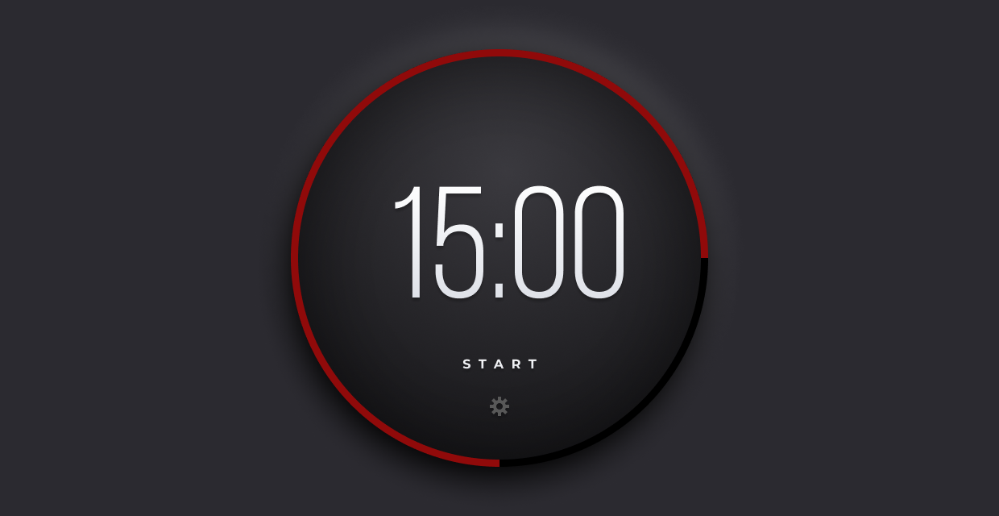
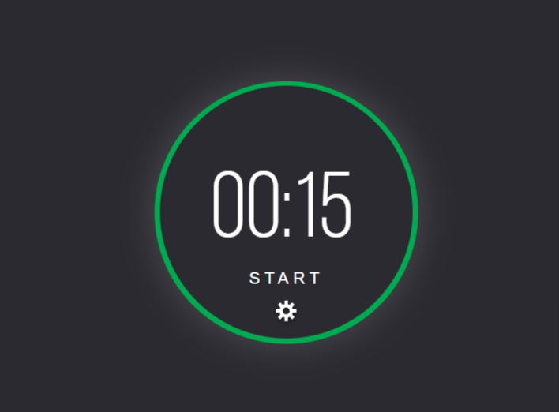
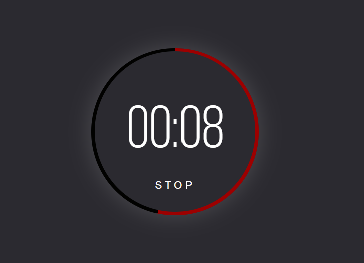
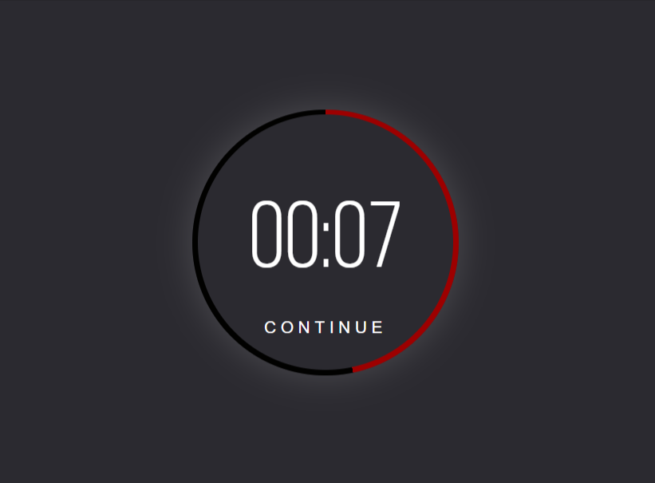
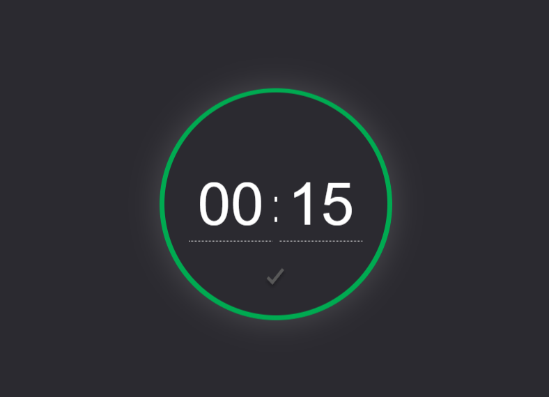

# Challenge #1 Pomodoro timer

## Problem

In this project, we're creating a Pomodoro timer.

You can use as many (or as few) tools, libraries, and frameworks as you'd like. If you're trying to learn something new, this might be a great way to push yourself.

### Users should be able to:

- Start the timer by clicking on the start link/button.
- Once the user clicks start, the word start will change to stop. Then, the user can click on the stop button to make the timer stop.
- Click on the gear icon to change the length (minutes and seconds) of the timer.
- Once the timer finishes, the ring should change from green to red and an alert message is passed to the browser.

### Getting Started

1. To get started, download the files within the December 1 section in Podia. This includes all the project assets you need to get started: a creative brief, a Figma file with the designs, fonts, and images.
2. Take a look around. Look at the project's Figma file. If you don't have a Figma account, don't worry, you can set one up for free.
3. Open the project's README.md file. It has additional information on how the project is structured.
4. Customize your project/file architecture to your liking.
5. Happy coding!
6. Once you're finished, share your work using #adventofcss

## My Solution Previews

