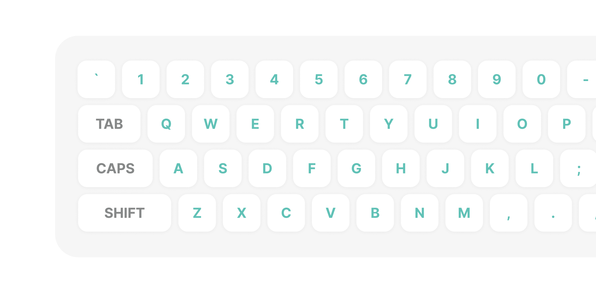

# Challenge #4: Computer Keyboard

## Brief

In this project, we're going to create a computer keyboard.

You can use as many (or as few) tools, libraries, and frameworks as you'd like. If you're trying to learn something new, this would be a great way to push yourself.

### Users should be able to

- See the computer keyboard centered on the page
- A random letter will start to jiggle.
- The user should type the same key that's jiggling and it will stop.
- A new, random key will start jiggling

## My Solution Preview

